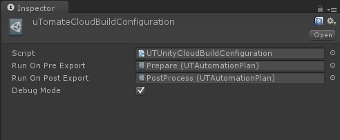

# Using uTomate with Unity Cloud Build

This is an example project showing how to use uTomate (http://www.ancientlightstudios.com/utomate) with Unity's Cloud build solution.     

## General considerations

Currently Unity Cloud Build supports two phases into which custom logic can be plugged - pre-export (that is before a player is built) and post-export (after the player is built, but before any potential XCode build). That is not an awful lot of flexibility, but it's a start.

## Setup
### In your project

1. Import this into your project. 
  * if you have a licensed copy of uTomate, you may want to replace the demo version in this project with your licensed copy (and make sure you don't accidently post the licensed copy on GitHub ;) ). 
2. Build some automation plans that you want to run in each of the phases. You don't need a plan for each phase, so e.g. if you don't need to do anything on pre-export, then you don't need to make a plan for this.
3. Open the uTomate cloud build settings (Window -> uTomate -> Edit Cloud Build Configuration)
  * You should see the cloud build configuration settings in the inspector: 
4. Drag your automation plans into the appropriate phases.
5. Enable debug mode, if you wish to.

### In Unity Cloud Build

1. Open the "Advanced Build Settings" for your build  
  * You may need to have the Unity guys unlock them for you, by filing a request.
2. In "Pre-Export Method Name", enter: `AncientLightStudios.UTomate.CloudBuild.UTCloudBuildRunner.OnPreExport`
3. In "Post-Export Method Name", enter: `AncientLightStudios.UTomate.CloudBuild.UTCloudBuildRunner.OnPostExport`
4. Save settings and run your build.

## What currently doesn't work

There is a bug in Unity's cloud build script which makes every build fail if the automation plan in the pre-export phase does changes that will make Unity reload assemblies. So things like opening and editing scenes, building asset bundles, etc. currently won't work in that phase. Setting player settings, the list of scenes, etc. seemed to work, but YMMV, please try it out.

(C) 2014 Ancient Light Studios